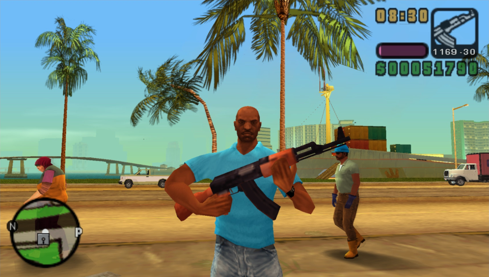

# GTAPSP-OHKO
**OHKO** (One-Hit Knockdown) mod for LCS/VCS on PSP!

# About

I made it because I noticed that every GTA had a OHKO mod, except the classic PSP ones (chinatown wars... meh idc)

It's a pretty simple plugin, very small in size!

 

# Installation

⚠️ WARNING: This plugin doesn't work with [gta_trophies](https://github.com/Freakler/psp-gta_trophies) by Freakler!

## PSP / Adrenaline 

1. Copy the prx file found inside ``GTAPSPOHKO`` folder (``GTA_OHKO.prx``) to ``ms0:/seplugins`` on your Memory Stick
2. Add to ``GAME.TXT`` (inside ``ms0:/seplugins``) the following line: ``ms0:/seplugins/GTA_OHKO.prx 1``

## PPSSPP

1. Copy the folder ``GTAPSPOHKO`` to ``PSP/PLUGINS`` directory

 

# Thanks

 - **Freakler**:
    - For creating Cheat Device Remastered (this plugin is based on CDR), also for testing the plugin!
